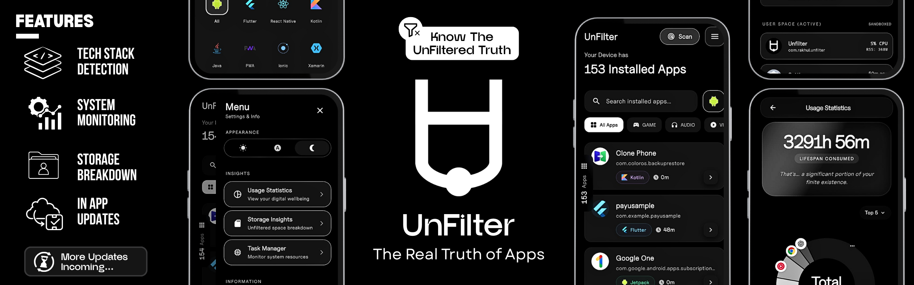
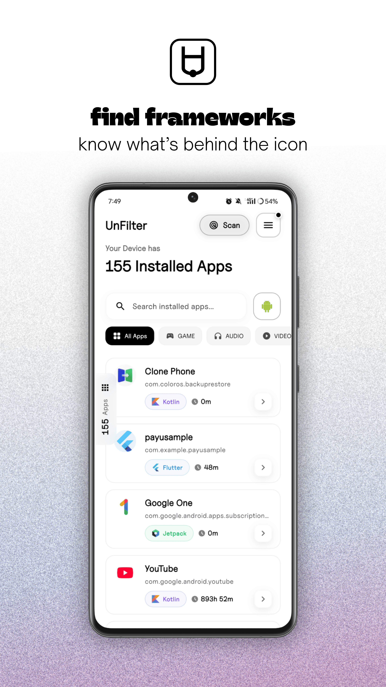
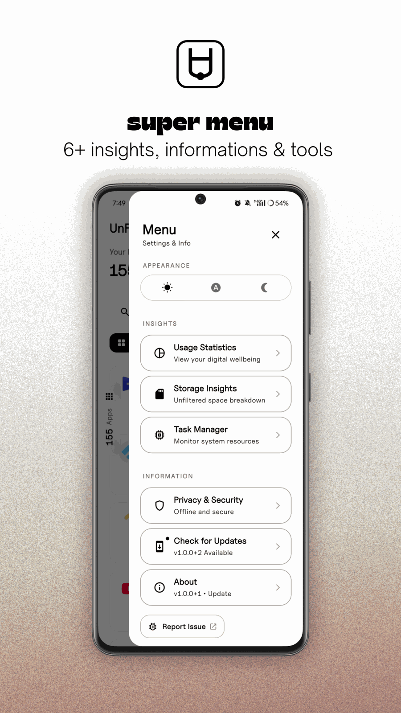
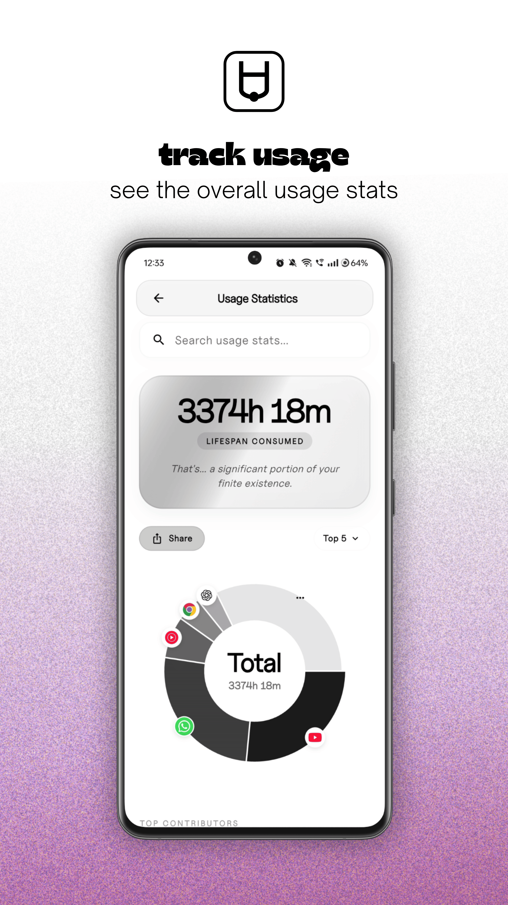
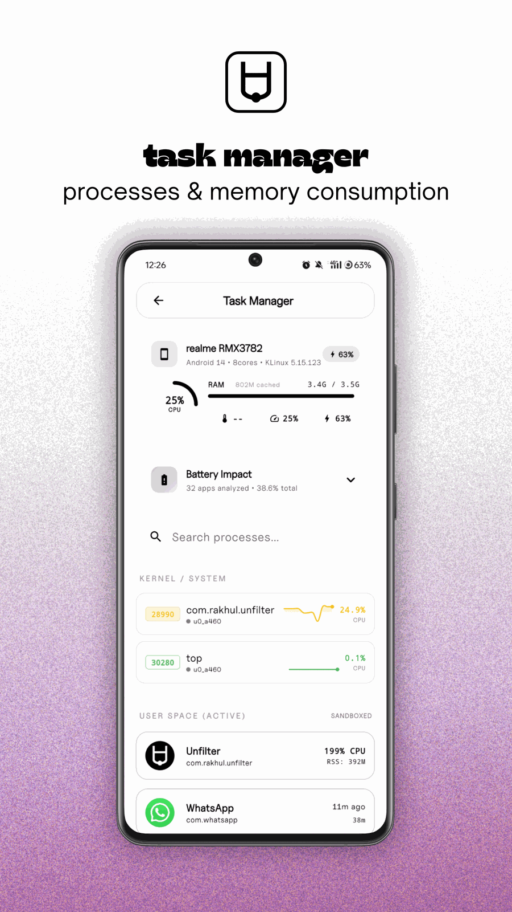
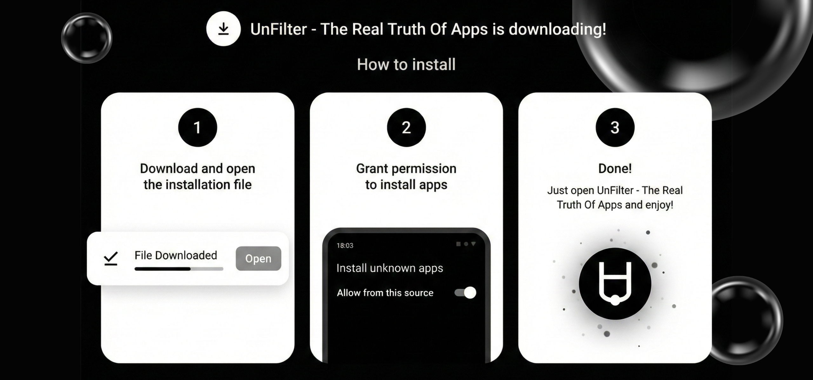

# Unfilter

<div align="center">

<a href="https://github.com/r4khul/unfilter/releases">
  
</a>
<a href="https://github.com/r4khul/unfilter/releases/latest">
  
</a>
<a href="https://github.com/r4khul/unfilter/stargazers">
  
</a>
<a href="https://github.com/r4khul/unfilter/blob/main/LICENSE">
  
</a>

<br><br>
<a href="https://play.google.com/store/apps/details?id=com.escapebranch.unfilter">

</a>

</div>

Unfilter is an on-device app intelligence tool for understanding what runs on your phone.

It fingerprints installed apps using framework signals, native clues, and shared libraries, then pairs that with usage, storage, and system insights.

## What It Does

- **App Fingerprinting**: Surfaces the frameworks, engines, and native signals hiding inside installed apps.
- **Dev-Friendly Insight**: Gives you a quick read on what an app is made of, without making it feel like a lab report.
- **Task Manager**: Real-time view of active processes and memory usage.
- **Storage & Usage**: Detailed analysis of app size, cache, and daily screen time.
- **System Info**: Overview of device sensor data, battery health, and hardware specs.
- **Private by Design**: Everything runs locally on your device.
- **Fun to Explore**: A polished UI that makes poking around feel lightweight instead of dry.

## Gallery

<p align="center">
  
  
  
</p>
<p align="center">
  
  
  
</p>

## Installation



## Download

Get the latest APK from the releases section.

## Development

To set up the project locally and build from source:

1. **Clone the repository**:
   ```bash
   git clone https://github.com/r4khul/unfilter.git
   ```
2. **Install dependencies**:
   ```bash
   flutter pub get
   ```
3. **Run the app**:
   ```bash
   flutter run
   ```

For more detailed instructions, check the [Contributing Guide](CONTRIBUTING.md).

## Privacy

- [Privacy Policy](https://unfilter-web.vercel.app/privacy)
- [Terms and Conditions](https://unfilter-web.vercel.app/terms)

## Project Documents

- [**Contributing Guide**](CONTRIBUTING.md): Guidelines for contributing to Unfilter.
- [**Code of Conduct**](CODE_OF_CONDUCT.md): Our community standards and expectations.
- [**Security Policy**](SECURITY.md): How to report security vulnerabilities.
- [**Changelog**](CHANGELOG.md): Detailed history of changes and versions.
- [**License**](LICENSE): GNU General Public License v3.0 (GPL-3.0).
